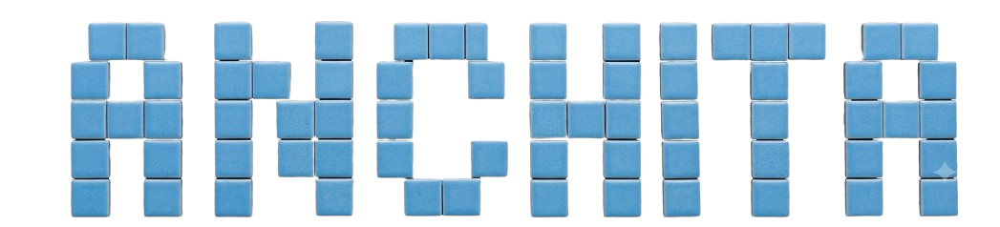

<div align="center">



</div>

<br/>

<table width="100%">
<tr>
<td width="65%" valign="middle">

### Hi There, I'm Anchita 👋
**I like to build cool stuff **

<a href="https://www.linkedin.com/in/anchita-m/"></a>
<a href="mailto:anchitamarodia07@gmail.com"></a>
<a href="https://github.com/Anchitamarodia"></a>

</td>
<td width="35%" align="center">


</td>
</tr>
</table>

<br/>

## 🌸 About Me

```yaml
name: Anchita Marodia
role: Full-Stack Web Developer & CS Student
education: B.Tech CSE @ Jain University, Bangalore (2024 - 2028)
currently_building: Cool things with the MERN stack ⚡
looking_to_collaborate: Open-source projects & hackathon teams 🚀
fun_fact: SIH 2024 Finalist — Ranked 1st at College Level 🏆
```

- 🔭 Freelance Web Developer with hands-on experience building responsive, production-ready apps
- 🌐 I love turning ideas into full-stack platforms — from schema design to pixel-perfect UI
- 🧩 Currently sharpening my DSA, OOP & DBMS fundamentals
- 💬 Ask me about React, Node.js, MongoDB, or REST APIs
- 🎯 Actively participating in hackathons and open-source contributions
- 🧠 Strong problem solver — comfortable debugging across the full stack, from UI to infra

<br/>

## 🚀 Tech Stack & Badges

**Languages**

<p>


</p>

**Frameworks & Libraries**

<p>


</p>

**Databases**

<p>


</p>

**Tools**

<p>


</p>

<br/>

## 🛠️ Featured Projects

<table>
<tr>
<td width="50%">

### 🎓 AlumniConnect
**MERN Stack · REST APIs · JWT**

Full-stack networking platform connecting students, alumni & administrators, with role-based access control across three dashboards and optimized MongoDB schemas.

</td>
<td width="50%">

### 🏭 Alfine
**React · Node.js · Express · MongoDB · Tailwind**

Industrial B2B website with a secure Admin Dashboard for CRUD-based inventory & gallery management, plus an automated inquiry system via SMTP/EmailJS.

</td>
</tr>
</table>

<br/>

## 📊 GitHub Stats

<div align="center">


</div>

<br/>

## 🐍 GitHub Contributions Heatmap

<div align="center">

</div>

<br/>

## 🏆 Achievements & Activities

- 🥇 **SIH 2024 Finalist** — Ranked 1st at College Level
- 💻 Active participant in hackathons and open-source contributions
- 🎤 Regular attendee of technical meetups and public speaking events

<br/>

## 📫 Let's Connect

<p align="center">
<a href="https://www.linkedin.com/in/anchita-m/"></a>
<a href="mailto:anchitamarodia07@gmail.com"></a>
</p>


</div>
